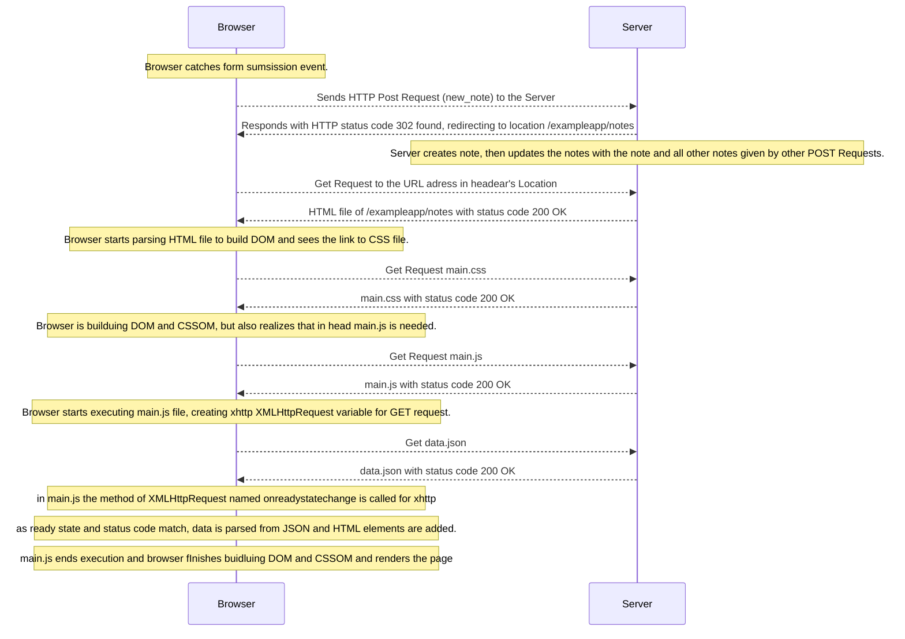

the exercise showcases (PRG) Post Redirect Get web design pattern. The diagram is describing events after creating submit button on the page https://studies.cs.helsinki.fi/exampleapp/notes

```mermaid
  sequenceDiagram
    participant Br as Browser
    participant Se as Server
    
    %% Form handling
    Note over Br: Browser catches form sumsission event. 
    Br-->>Se: Sends HTTP Post Request (new_note) to the Server
    Se-->>Br: Responds with HTTP status code 302 found, redirecting to location /exampleapp/notes

    %% Get HTML notes page request.
    Note over Se: Server creates note, then updates the notes with the note and all other notes given by other POST Requests.
    Br-->>Se: Get Request to the URL adress in headear's Location
    Se-->>Br: HTML file of /exampleapp/notes with status code 200 OK

    %% Get CSS file request
    Note over Br: Browser starts parsing HTML file to build DOM and sees the link to CSS file.
    Br-->>Se: Get Request main.css
    Se-->>Br: main.css with status code 200 OK

    %% Get JS file request
    Note over Br: Browser is builduing DOM and CSSOM, but also realizes that in head main.js is needed.
    Br-->>Se: Get Request main.js
    Se-->>Br: main.js with status code 200 OK

    %% Fetch JSON request
    Note over Br: Browser starts executing main.js file, creating xhttp XMLHttpRequest variable for GET request.
    Br-->>Se: Get data.json
    Se-->>Br: data.json with status code 200 OK

    %% Builduing site
    Note over Br: in main.js the method of XMLHttpRequest named onreadystatechange is called for xhttp
    Note over Br: as ready state and status code match, data is parsed from JSON and HTML elements are added.
    Note over Br: main.js ends execution and browser fInishes buidluing DOM and CSSOM and renders the page
```
