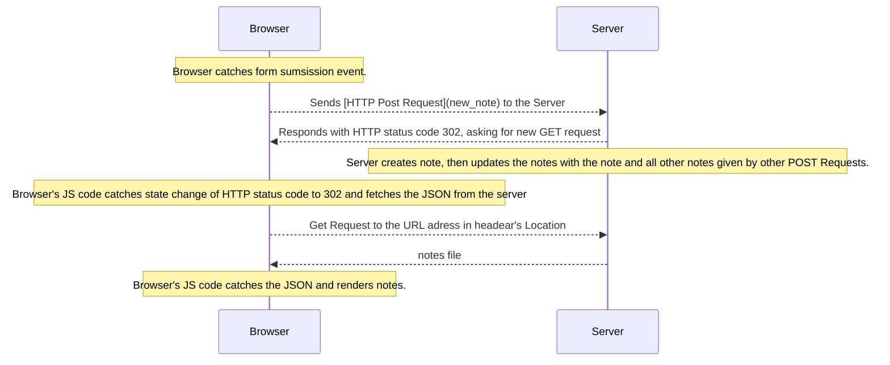

```mermaid
  sequenceDiagram
    participant Br as Browser
    participant Se as Server
    
    %% Form handling
    Note over Br: Browser catches form sumsission event. 
    Br-->>Se: Sends [HTTP Post Request](new_note) to the Server
    Se-->>Br: Responds with HTTP status code 302, asking for new GET request
    
    %% Fetch JSON request
    Note over Se: Server creates note, then updates the notes with the note and all other notes given by other POST Requests.
    Note over Br: Browser's JS code catches state change of HTTP status code to 302 and fetches the JSON from the server
    Br-->>Se: Get Request to the URL adress in headear's Location
    Se-->>Br: notes file
    
    %% Rendering notes
    Note over Br: Browser's JS code catches the JSON and renders notes. 
```
