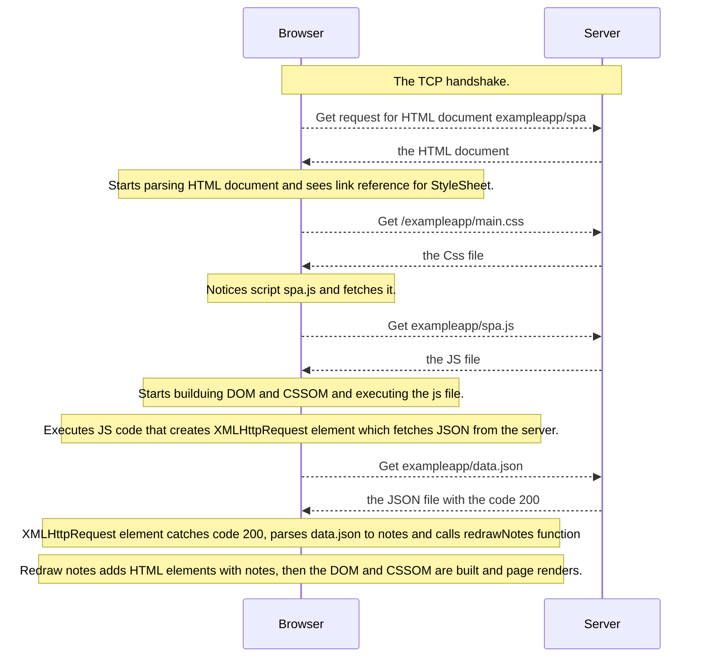

```mermaid
  sequenceDiagram
    participant Br as Browser
    participant Se as Server

    Note over Br, Se: The TCP handshake.
    %% Fetching HTML
    Br-->>Se: Get request for HTML document exampleapp/spa
    Se-->>Br: the HTML document
    Note over Br: Starts parsing HTML document and sees link reference for StyleSheet.

    %% Fetching CSS
    Br-->>Se: Get /exampleapp/main.css
    Se-->>Br: the Css file
    Note over Br: Notices script spa.js and fetches it.

    %% Fetching JS
    Br-->>Se: Get exampleapp/spa.js
    Se-->>Br: the JS file
    Note over Br: Starts builduing DOM and CSSOM and executing the js file.
    

    %% Fetching JSON data
    Note over Br: Executes JS code that creates XMLHttpRequest element which fetches JSON from the server.
    Br-->>Se: Get exampleapp/data.json
    Se-->>Br: the JSON file with the code 200
    Note over Br: XMLHttpRequest element catches code 200, parses data.json to notes and calls redrawNotes function
    Note over Br: Redraw notes adds HTML elements with notes, then the DOM and CSSOM are built and page renders.
```
