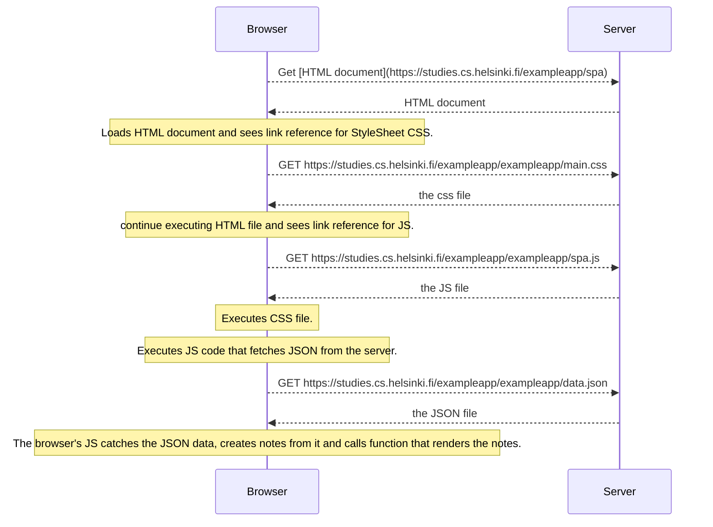

```mermaid
  sequenceDiagram
    participant BR as Browser
    participant SE as Server

    %% Fetching HTML
    BR-->>SE: Get [HTML document](https://studies.cs.helsinki.fi/exampleapp/spa)
    SE-->>BR: HTML document
    Note over BR: Loads HTML document and sees link reference for StyleSheet CSS.

    %% Fetching CSS
    BR-->>SE: GET https://studies.cs.helsinki.fi/exampleapp/exampleapp/main.css
    SE-->>BR: the css file
    Note over BR: continue executing HTML file and sees link reference for JS.

    %% Fetching JS
    BR-->>SE: GET https://studies.cs.helsinki.fi/exampleapp/exampleapp/spa.js
    SE-->>BR: the JS file
    Note over BR: Executes CSS file.
    Note over BR: Executes JS code that fetches JSON from the server.

    %% Fetching JSON data
    BR-->>SE: GET https://studies.cs.helsinki.fi/exampleapp/exampleapp/data.json
    SE-->>BR: the JSON file
    Note over BR: The browser's JS catches the JSON data, creates notes from it and calls function that renders the notes.
```
