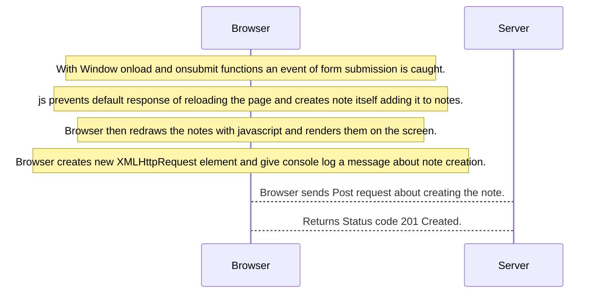

Note creation diagram of https://studies.cs.helsinki.fi/exampleapp/spa

```mermaid

 sequenceDiagram
    participant Br as Browser
    participant Se as Server

    %% Form submission
    Note over Br: With Window onload and onsubmit functions an event of form submission is caught.
    Note over Br: js prevents default response of reloading the page and creates note itself adding it to notes.
    Note over Br: Browser then redraws the notes with javascript and renders them on the screen.
    Note over Br: Browser creates new XMLHttpRequest element and give console log a message about note creation.
    Br--> Se: Browser sends Post request about creating the note.
    Se--> Br: Returns Status code 201 Created.
    

```
